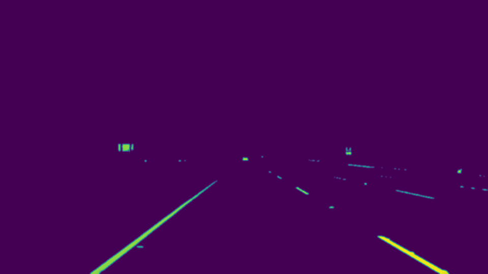
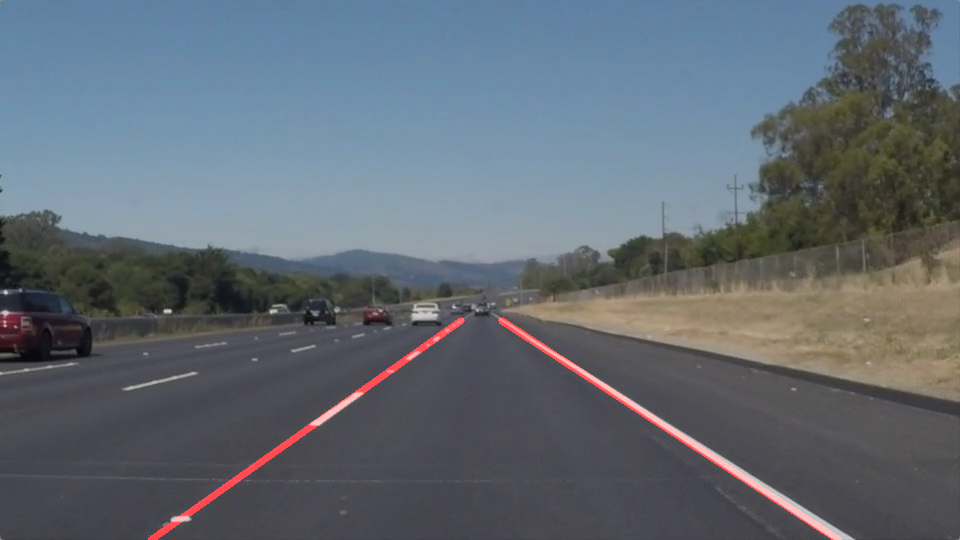
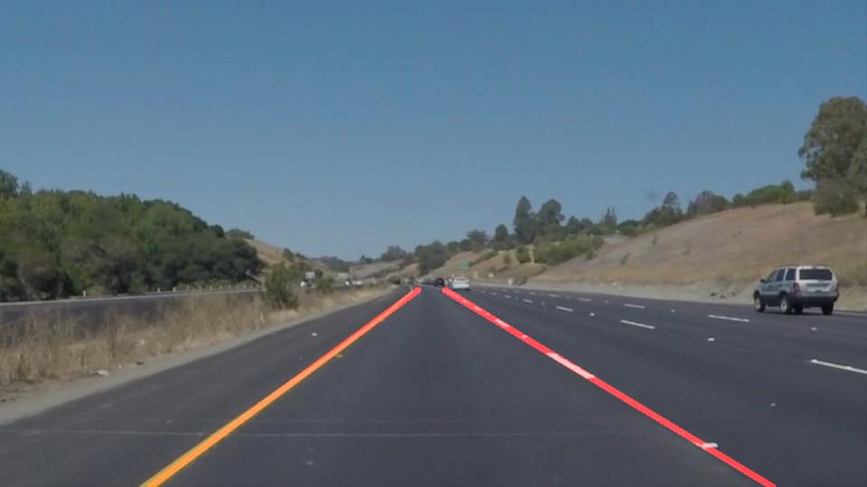
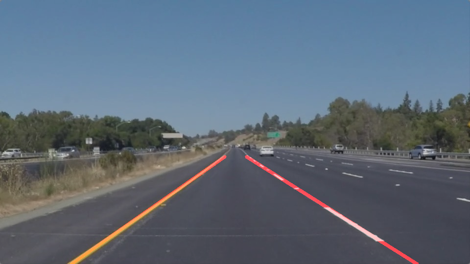

# **Finding Lane Lines on the Road** 

The goals of this project is to make a pipeline that finds lane lines on the road using python and OpenCV. See an exmple blow:

        

The pipeline will be tested on some images and videos provided by Udacity. 

## Reflection

### 1. Pipeline Description

My pipeline consisted of the following 6 steps:
1. Read in and convert the input images to grayscale for easier manipulation;

2. Apply Gaussian Blur to smoothen the edges;

3. Apply Canny Edge Detection on smoothed gray image;

4. Select region of interest;

5. Apply Hough Tranform line detection;

6. Draw the lines on the original image.

In order to draw a single line on the left and right lanes, I modified the draw_lines() function as following:

Basically, I'm trying to find 4 points to form 2 straight lines: one on the left and another one on the right
- Frist, I separated left and right lanes by using their slope ((y2-y1)/(x2-x1)):
  - Left lane: as x value increases, y value decreases: slope must thus be negative, and should be less than -0.5 in all the images and videos for testing provided by Udacity;
  - Right lane: as x value increases, y value increases: slope must thus be positive, and should be large than 0.5 in all the images and videos for testing provided by Udacity.
- Second, after we got 2 lists of Y locations for left and right lanes, we can easily find Y locations for the final 4 points we are looking for:	
  - Y locations for the bottom 2 points will just be image.shape[0], which is the maximum Y location of the image;
  - Y locations for the top 2 points will just be the minimum Y locations of all the lanes we detected.
- Third, since we already find the Y locations, we can use numpy.polyfit to find a vector of coefficients that minimises the squared error for x = ay + b.
- Then, we used the coefficients to generate polynomials, and using polynomials to get X locations for all the 4 points.
- Finally, we can plot left line and right line seperately by using the 4 points we found.

###  Result

Here are results on test images provided by Udacity: 

        
        
        

The original pictures and the output pictures can be found in the folder test_images and test_images_output respectively.

The original videos and the output videos can be found in the folder test_videos and test_videos_output respectively.

### 2. Optional Challenge
The results I got while applying the pipeline to the first two videos provided by Udacity were decent, but it was not the case for the challenge video. 

In the challenge, video there are more difficulties:
- The car is driving on a curving road
- The brightness and color of the asphalt varies a lot due to light intensity of the sun as well as shadows of the trees. 

As a result, the Canny edge detector is not able to find the line using the grayscale image (where we lose info of the color).

To overcome these problems, I apply the color isolation before grayscaling and also resize the region of interest. 
- After reading in the image, I first convert original image from RGB to HSL;
- Secondly, I isolate yellow and white from HSL image; 
- Then combine isolated HSL with original image to get a combined_hsl_image;
 

- After the above color isolation, I apply my 6 step pipeline with the combined image.
- I also resize the region of interest according to the dimensions of this video.

The output video I got was not as good as the previous 2 output video: the right line is a little jumpy mainly because of the curve, since I was trying to fit a straight line on a curvy lane. 

The original challenge video and the output video can be found in the folder test_videos and test_videos_output respectively.

### 3. Identify potential shortcomings with your current pipeline

The following assumptions are made according to all of the testing images and videos provided by Udacity :
- The camera has always being in the same position with respect to the road;
- The visibility of white or yellow lines is always clear on the road;
- The vehicles in the same lanes are very far from us;
- The road scenarios are always under good weather conditions.

As the result, the pipeline might not work properly, when the following cases(as I can think of now) occur:
- If the camera is placed at a different position, the region of interest need to be also adjusted;
- If one or more lanes are missing, we can probably use the information from previous frames and estimate the slope and positions of the missing lanes;
- If other vehicles in front are occluding the view;
- At different weather and light condition (fog, rain, snow or at night).

### 4. Suggest possible improvements to your pipeline

- Adjust the region of interest mask dynamically;
- If lines cannot be detected in current frame, we can use the information from previous frames and estimate the slope and positions of the missing lanes;
- Further improve the draw_lines() function, so it works better for curve lanes also;
- Apply better filter and detector, which can extract lanes under the 3rd and 4th cases I metioned above.

