# **Finding Lane Lines on the Road** 

The goals of this project is to make a pipeline that finds lane lines on the road using python and OpenCV. See an exmple blow:

        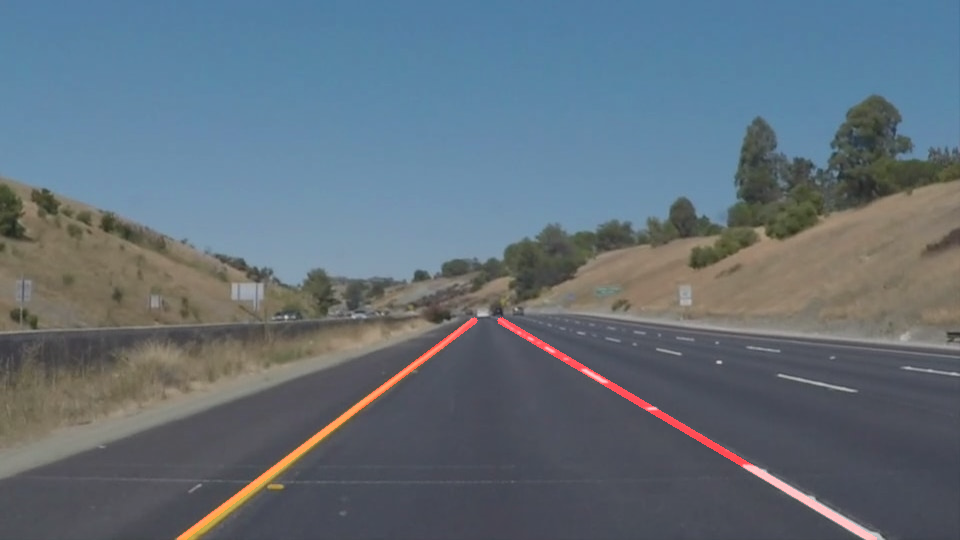

The pipeline will be tested on some images and videos provided by Udacity. 

## Reflection

### 1. Pipeline Description

My pipeline consisted of the following 6 steps:
1. Read in and convert the input images to grayscale for easier manipulation;
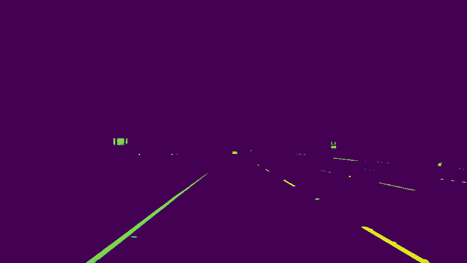
2. Apply Gaussian Blur to smoothen the edges;
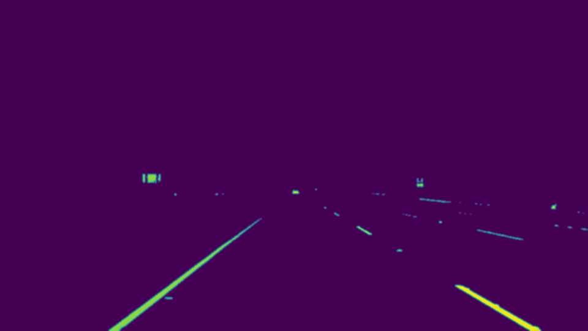
3. Apply Canny Edge Detection on smoothed gray image;
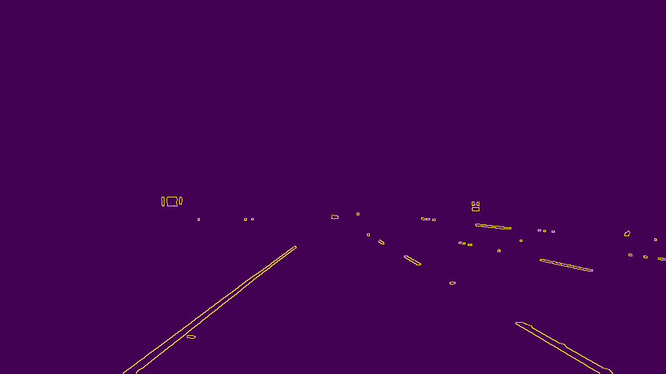
4. Select region of interest;
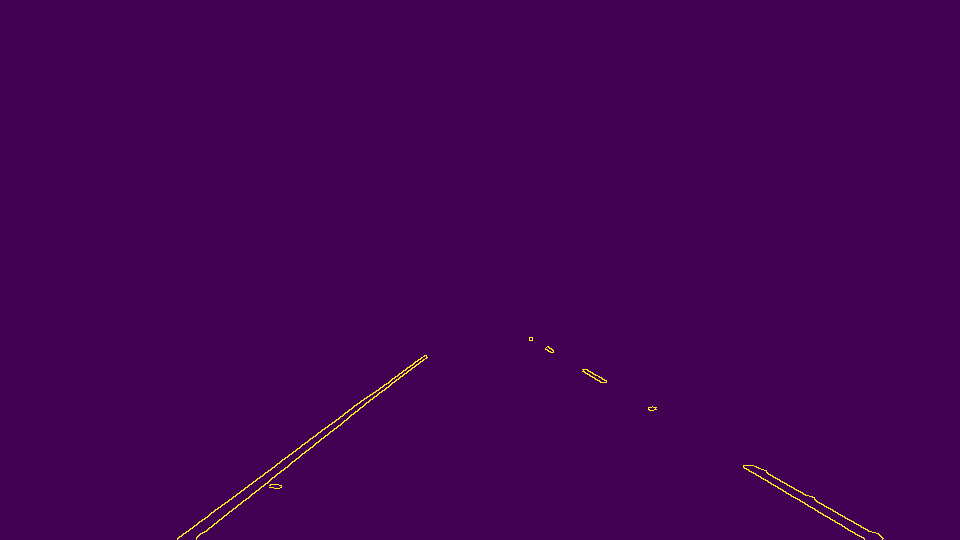
5. Apply Hough Tranform line detection;
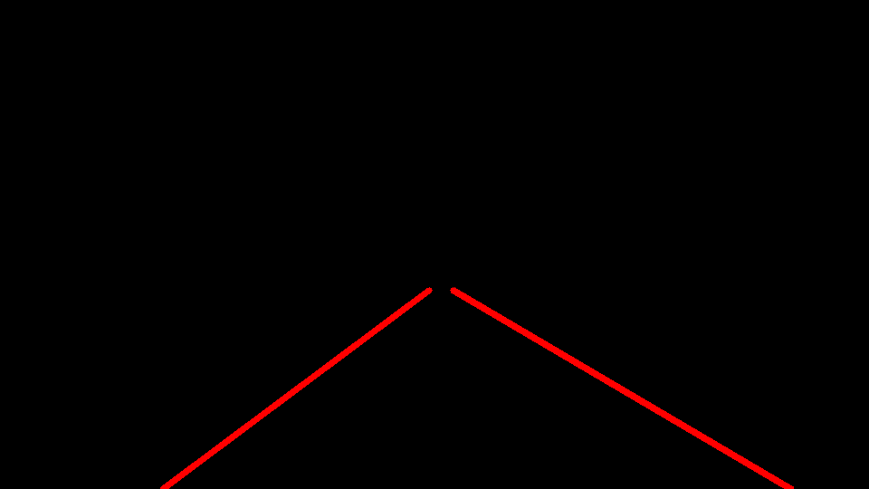
6. Draw the lines on the original image.

In order to draw a single line on the left and right lanes, I modified the draw_lines() function as following:

Basically, I'm trying to find 4 points to form 2 straight lines: one on the left and another one on the right
- Frist, I separated left and right lanes by using their slope ((y2-y1)/(x2-x1)):
  - Left lane: as x value increases, y value decreases: slope must thus be negative, and should be less than -0.5 in all the images and videos for testing provided by Udacity;
  - Right lane: as x value increases, y value increases: slope must thus be positive, and should be large than 0.5 in all the images and videos for testing provided by Udacity.
- Second, after we got 2 lists of Y locations for left and right lanes, we can easily find Y locations for the final 4 points we are looking for:	
  - Y locations for the bottom 2 points will just be image.shape[0], which is the maximum Y location of the image;
  - Y locations for the top 2 points will just be the minimum Y locations of all the lanes we detected.
- Third, since we already find the Y locations, we can use numpy.polyfit to find a vector of coefficients that minimises the squared error for x = ay + b.
- Then, we used the coefficients to generate polynomials, and using polynomials to get X locations for all the 4 points.
- Finally, we can plot left line and right line seperately by using the 4 points we found.

####  Result
Here are some results on test images provided by Udacity: 
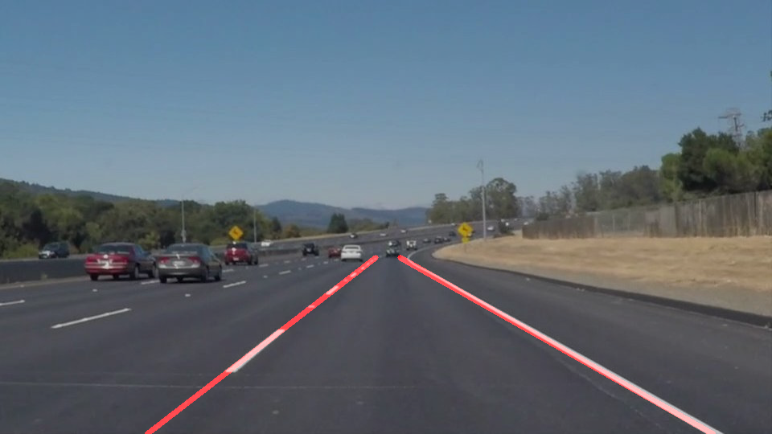        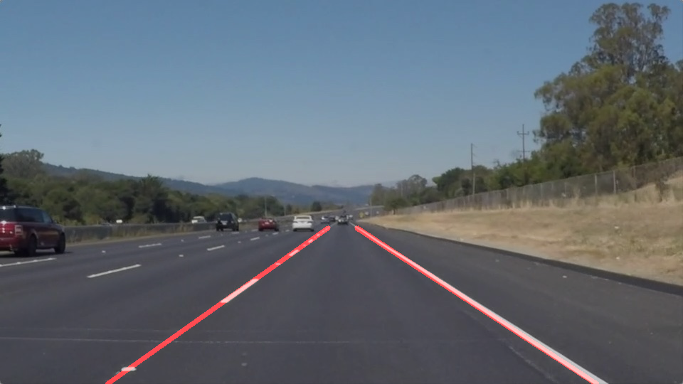
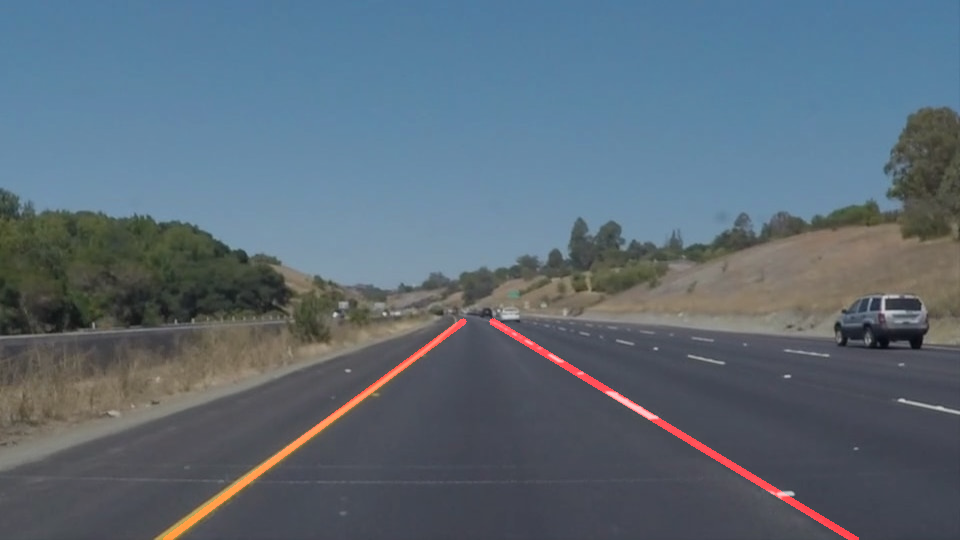        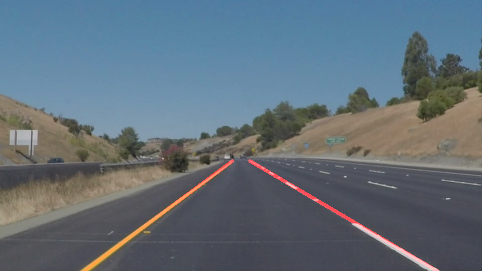
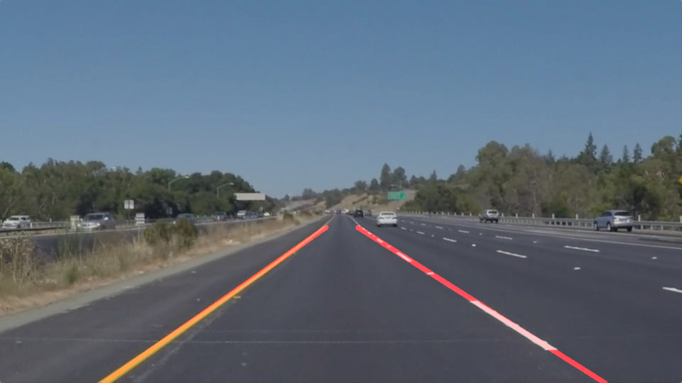        

### 2. Optional Challenge

### 3. Identify potential shortcomings with your current pipeline

One potential shortcoming would be what would happen when ... 

Another shortcoming could be ...

### 4. Suggest possible improvements to your pipeline

A possible improvement would be to ...

Another potential improvement could be to ...
https://medium.com/computer-car/udacity-self-driving-car-nanodegree-project-1-finding-lane-lines-9cd6a846c58c
http://jokla.me/robotics/lane-detection/
https://medium.com/@tjosh.owoyemi/finding-lane-lines-with-colour-thresholds-beb542e0d839
