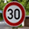
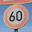

# **Traffic Sign Recognition** 

## Writeup

**Build a Traffic Sign Recognition Project**

The goals / steps of this project are the following:
* Load the data set (see below for links to the project data set)
* Explore, summarize and visualize the data set
* Design, train and test a model architecture
* Use the model to make predictions on new images
* Analyze the softmax probabilities of the new images
* Summarize the results with a written report

Here is a link to my [project code](https://github.com/yuxihe/SelfDrivingCarProj/blob/master/P2-CarND-TrafficSigns/Traffic_Sign_Classifier.ipynb)

### Data Set Summary & Exploration

#### 1. Provide a basic summary of the data set. In the code, the analysis should be done using python, numpy and/or pandas methods rather than hardcoding results manually.

I used the pandas library to calculate summary statistics of the traffic
signs data set:

* The size of training set is 34799
* The size of the validation set is 4410
* The size of test set is 12630 
* The shape of a traffic sign image is 32 * 32 * 3
* The number of unique classes/labels in the data set is 43

#### 2. Include an exploratory visualization of the dataset.

Here is an plot showing visualization of the data set for training, validation and testing.

### Design and Test a Model Architecture

My dataset preprocessing consisted of 3 steps:

- As a first step, I decided to convert the images to grayscale because it helps to reduce training time, which was nice when a GPU wasn't available. And since the network was well trained with grayscale images, it will be more robust when unclear colored traffic signs encounter. 

Here is an example of a traffic sign image before and after grayscaling.

- As the second step, I normalized the image data by using new_pixel = (pixel - 128) / 128, because this has the effect of zero-centering the data, and making the data fall within the range -1 to 1. Input that having a wider distribution in the data would make it more difficult to train using a singlar learning rate. Different features could encompass far different ranges and a single learning rate might make some weights diverge. So standardizing the pixel values helps gradient descent converge faster.

- As the last step, I converted the output class labels into one-hot encoded labels. This is important because different traffic signs do not have integer-like relationships with one another. By converting all labels into one-hot encoded labels, this incorrect underlying assumption can be avoid.

#### 2. Describe what your final model architecture looks like including model type, layers, layer sizes, connectivity, etc.) Consider including a diagram and/or table describing the final model.

My final model consisted of the following layers:

| Layer         		|     Description	        					| 
|:---------------------:|:---------------------------------------------:| 
| Input         		| 32x32x1 grayscal image   						| 
| Convolution 3x3     	| 1x1 stride, valid padding, outputs 28x28x6 	|
| RELU					|												|
| Max pooling	      	| 2x2 ksize 2x2 stride,  outputs 14x14x6   		|
| Convolution 3x3     	| 1x1 stride, valid padding, outputs 10x10x16 	|
| RELU					|												|
| Max pooling	      	| 2x2 ksize 2x2 stride,  outputs 5x15x16   		|
| Flatten input 	    | output 400      								|
| Fully connected		| output 200        							|
| Dropout				|           									|
| Fully connected		| output 43         							|

#### 3. Describe how you trained your model. The discussion can include the type of optimizer, the batch size, number of epochs and any hyperparameters such as learning rate.

To train the model, I used the Adam optimizer, which is already implemented in the LeNet lab. And the final settings used were:

| Hyperparameters               |  Setting                  | 
|:-----------------------------:|:-------------------------:| 
| batch size         	        | 128  						| 
| epochs     	                | 30                    	|
| learning rate			        | 0.01						|
| mu        	      	        | 0                   		|
| sigma              	        | 0.1                    	|
| dropout keep probability      | 0.5                    	|

#### 4. Describe the approach taken for finding a solution and getting the validation set accuracy to be at least 0.93. 

My final model results was:
* validation set accuracy of 0.96
* test set accuracy of 0.943

My approach was based on an already well known implementation. I started with pre-defined architecture (LeNet architecture), since traffic sign classification is an image classification problem, which is similar to character recognition. I simplified and shrank the model to 2 fully connected layer and also add dropout between them to better fit the traffic sign classification problem at hand. And I also tried data preprocessing, hyperparameter tuning, etc. A potential enhancement to this project would be to explore more complicated neural network architectures. The log in jupyter notebook shows how my training and validation accuracy improved during each epoch.

 

### Test a Model on New Images

#### 1. Choose five German traffic signs found on the web and provide them in the report. For each image, discuss what quality or qualities might be difficult to classify.

Here are eleven German traffic signs that I found on the web:

I downloaded 11 traffic sign images randomly online. All 11 images are color images. The brightness of some images are not as good as the others, which can test how robust my network is when encouter unclear signs.

#### 2. Discuss the model's predictions on these new traffic signs and compare the results to predicting on the test set. At a minimum, discuss what the predictions were, the accuracy on these new predictions, and compare the accuracy to the accuracy on the test set (OPTIONAL: Discuss the results in more detail as described in the "Stand Out Suggestions" part of the rubric).

Here are the results of the prediction:

| Image			            |     Prediction	        					| 
|:-------------------------:|:---------------------------------------------:| 
| Speed limit (100km/h)     | Speed limit (100km/h)   						| 
| Speed limit (30km/h)     	| Speed limit (30km/h) 							|
| No entry					| No entry										|
| General caution	      	| General caution					 			|
| Keep right			    | Keep right     							    |
| Road work                 | Road work                 					| 
| Speed limit (30km/h)     	| Speed limit (30km/h) 							|
| Speed limit (60km/h)		| Speed limit (60km/h)							|
| Go straight or right	   	| Go straight or right					 		|
| Turn left ahead			| Turn left ahead    							|
| Yield			            | Yield    				            			|

The model was able to correctly guess 11 of the 11 traffic signs, which gives an accuracy of 100% - even better than the 96% validation accuracy and the 94.3% test accuracy. This is a good sign that the model performs well on real-world data. But since I only tried 11 images, the sample size is too small to draw a solid conclusion.

#### 3. Describe how certain the model is when predicting on each of the five new images by looking at the softmax probabilities for each prediction. Provide the top 5 softmax probabilities for each image along with the sign type of each probability. (OPTIONAL: as described in the "Stand Out Suggestions" part of the rubric, visualizations can also be provided such as bar charts)

The code for making predictions on my final model is located in the 14th cell of the Ipython notebook.

For the first image, the top five soft max probabilities were

| Probability         	 |     Prediction	        	   				 | 
|:----------------------:|:---------------------------------------------:| 
| .962316                | Speed limit (100km/h)                         |
| 0.0320635              | Speed limit (80km/h)                          |
| 0.00402459             | Speed limit (30km/h)                          |
| 0.00158103             | Speed limit (50km/h)                          |
| 1.10004e-05            | Speed limit (60km/h)                          |

#2 image.  Top 5 incides are:  [1 5 3 6 4]
Possible ClassId are:
0.999999 Speed limit (30km/h)
5.37672e-07 Speed limit (80km/h)
3.77008e-09 Speed limit (60km/h)
1.1529e-11 End of speed limit (80km/h)
1.31734e-12 Speed limit (70km/h)
#3 image.  Top 5 incides are:  [17  9 30 33 14]
Possible ClassId are:
1.0 No entry
1.86016e-09 No passing
3.02651e-13 Beware of ice/snow
9.48803e-14 Turn right ahead
2.9653e-14 Stop
#4 image.  Top 5 incides are:  [18 26 11 27 38]
Possible ClassId are:
1.0 General caution
1.04495e-17 Traffic signals
4.3103e-19 Right-of-way at the next intersection
7.2855e-22 Pedestrians
6.22565e-23 Keep right
#5 image.  Top 5 incides are:  [38  0  1  2  3]
Possible ClassId are:
1.0 Keep right
0.0 Speed limit (20km/h)
0.0 Speed limit (30km/h)
0.0 Speed limit (50km/h)
0.0 Speed limit (60km/h)
#6 image.  Top 5 incides are:  [25 29 22 20 35]
Possible ClassId are:
1.0 Road work
8.37017e-17 Bicycles crossing
7.2024e-17 Bumpy road
1.50548e-18 Dangerous curve to the right
1.31295e-19 Ahead only
#7 image.  Top 5 incides are:  [1 2 5 3 7]
Possible ClassId are:
0.999999 Speed limit (30km/h)
7.84494e-07 Speed limit (50km/h)
2.66463e-11 Speed limit (80km/h)
5.74788e-14 Speed limit (60km/h)
7.36425e-16 Speed limit (100km/h)
#8 image.  Top 5 incides are:  [ 3  6  5 20  2]
Possible ClassId are:
0.999999 Speed limit (60km/h)
7.94535e-07 End of speed limit (80km/h)
8.46585e-08 Speed limit (80km/h)
1.69821e-09 Dangerous curve to the right
4.27803e-11 Speed limit (50km/h)
#9 image.  Top 5 incides are:  [36 38 17 25 40]
Possible ClassId are:
0.862122 Go straight or right
0.0549792 Keep right
0.0484582 No entry
0.0261883 Road work
0.0077191 Roundabout mandatory
#10 image.  Top 5 incides are:  [34 38 30 35 32]
Possible ClassId are:
0.999999 Turn left ahead
7.08012e-07 Keep right
1.08326e-11 Beware of ice/snow
1.07908e-11 Ahead only
3.18253e-12 End of all speed and passing limits
#11 image.  Top 5 incides are:  [13 35 12 32  3]
Possible ClassId are:
1.0 Yield
5.80352e-15 Ahead only
5.43181e-15 Priority road
2.00782e-15 End of all speed and passing limits
4.00597e-18 Speed limit (60km/h)