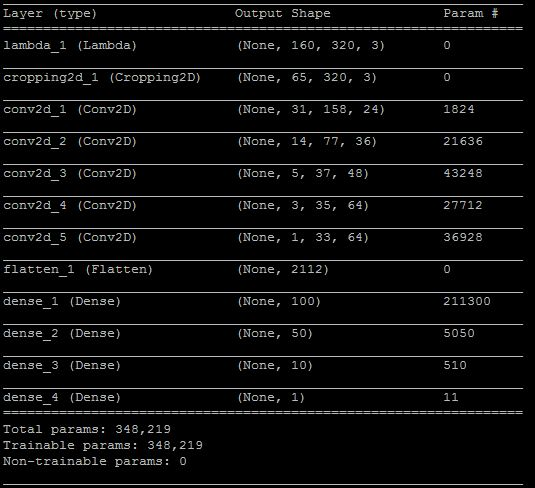

# **Behavioral Cloning** 

## **Goals**

The goals / steps of this project are the following:
* Use the simulator to collect data of good driving behavior
* Build, a convolution neural network in Keras that predicts steering angles from images
* Train and validate the model with a training and validation set
* Test that the model successfully drives around track one without leaving the road
* Summarize the results with a written report

## Rubric Points
#### Here I will consider the [rubric points](https://review.udacity.com/#!/rubrics/432/view) individually and describe how I addressed each point in my implementation.  

---
### Files Submitted & Code Quality

#### 1. Submission includes all required files and can be used to run the simulator in autonomous mode

My project includes the following files:
* model.py containing the script to create and train the model
* drive.py for driving the car in autonomous mode (This file is provided by Udacity, my only modification was to increase the car speed on line 47 from 9 to 18)
* model.h5 containing a trained convolution neural network 
* README.md summarizing the results
* video.mp4 recording of the vehicle driving autonomously around the first track for one full lap

Note:
At the beginning of working on this project, I tried LeNet model and NVIDIA Autonomous Car Group model. These experiments could be found at clone.py.

#### 2. Submission includes functional code

Using the Udacity provided simulator and my drive.py file, the car can be driven autonomously around the track by executing 
```sh
python drive.py model.h5 run1
```
The above command will load the trained model and use the model to make predictions on individual images in real-time and send the predicted angle back to the server via a websocket connection. And the fourth argument, run1, is the directory in which to save the images for video.mp4 seen by the agent. If the directory already exists, it'll be overwritten.

#### 3. Submission code is usable and readable

The model.py file contains the code for training and saving the convolution neural network. The file shows the pipeline I used for training and validating the model, and it contains comments to explain how the code works.

### Model Architecture and Training Strategy

#### 1. An appropriate model architecture has been employed

I'm using the NVIDIA Autonomous Car Group model, which can be summarized as following:



The network consists of a normalization layer, followed by 5 convolution layers and then followed by 4 fully-connected layers. 

- First, the data was normalized in the model using a Keras lambda layer (model.py line 66). 
- Secondly, each image was cropped by choosing only the portion that is useful for predicting a steering angle, and excludes the sky togeter with the hood of the car, this might help to train the model faster (model.py line 67).
- Then, the NVIDIA Autonomous Car Group model was implemented (model.py line 68 - 77).

#### 2. Attempts to reduce overfitting in the model

I completely followed the NVIDIA Autonomous Car Group model without applying any regularization techniques like Dropout or Max pooling. Instead, to reduce overfitting:

- I kept the training epochs low: 5 epochs. 
- Also, the model was trained and validated on different data sets by splitting the sample data with 80% for training and 20% for validation (model.py line 17). 

The model was tested by running it through the simulator and ensuring that the vehicle could stay on the track.

#### 3. Model parameter tuning

The model used an adam optimizer, so the learning rate was not tuned manually (model.py line 79).

#### 4. Appropriate training data

Training data was chosen to keep the vehicle driving on the road. 

- I used a combination of center lane driving, recovering from the left and right sides of the road. 
- I flipped images and took the opposite sign of the steering measurement to help with the left turn bias. 
- I also used all three different angles of image: center, left and right to train the model. 

For details about how I created the training data, see the next section. 

### Model Architecture and Training Strategy

#### 1. Solution Design Approach

My overall strategy for deriving a model architecture was to implement an existing well known network first, then add or remove layers based on the training and validation results.

In order to quickly gauge how well the model was working, I used the training data provided by Udacity and split the image data and steering angle data into a training and validation set. 

The first existing well-known model I tried was the LeNet model(http://yann.lecun.com/exdb/lenet/), I thought this model might be appropriate because it performed well on many classification problems, and since figuring out steering angle can also be treated as a similar issue. I trained the model with the data set I mentioned above. After 5 epochs, on the first track, the car went straight to the lake. I added some pre-processing steps. A new Lambda layer was introduced to normalize the input images to zero means. This step allows the car to move a little bit further, but it didn't get to the first turn. Another Cropping layer was then introduced, to choose only the portion that is useful for predicting a steering After these 2 steps, the first turn was almost there, but not quite. 

I think the unsatisfied performance of the LeNet model on this driving steering angle prediction is mainly because the steering angle is a continous value, which might not be easily classified to one of the category.

Then I tried a more powerfull model: NVIDIA Autonomous Car Group model(https://devblogs.nvidia.com/deep-learning-self-driving-cars/). I only added an output layer at the end to have a single output. This time the car sucessfully did its first complete track, but there were a few spots where the vehicle fell off the track. To improve the driving behavior in these cases, more training data was needed. I augmented the data by flipping the same image and taking the opposite sign of the steering measurement to help with the left turn bias (model.py line 43 - 49). In addition to that, I also used the left and right camera images with a correction factor on the angle to help the car go back to the center lane with more soft or sharp turn (model.py lines 29 - 41). 

At the end of the process, the vehicle is able to drive autonomously around the track without leaving the road.

#### 2. Final Model Architecture

The final model architecture (model.py lines 66 - 77) I used is the NVIDIA Autonomous Car Group model with the following layers:

- First, the data was normalized in the model using a Keras lambda layer (model.py line 66). 
- Secondly, each image was cropped by choosing only the portion that is useful for predicting a steering angle, and excludes the sky togeter with the hood of the car, this might help to train the model faster(model.py line 67).
- Finally, there were 5 convolution layers and then followed by 4 fully-connected layers (model.py line 68 - 77).

Here is a visualization of the architecture:

| Layer         		|     Description	        					| 
|:---------------------:|:---------------------------------------------:| 
| Input         		| 160x320x3 image       						| 
| Lambda         		| Normalization            						| 
| Cropping2D         	| cropping=((70,25), (0,0))       				| 
| Convolution 5x5     	| 2x2 stride, filter=24                     	|
| RELU					|												|
| Convolution 5x5     	| 2x2 stride, filter=36                     	|
| RELU					|												|
| Convolution 5x5     	| 2x2 stride, filter=48                     	|
| RELU					|												|
| Convolution 3x3     	| 1x1 stride, filter=64                     	|
| RELU					|												|
| Convolution 3x3     	| 1x1 stride, filter=64                     	|
| RELU					|												|
| Flatten input       	| output 8448                					|
| Fully connected		| output 100        							|
| Fully connected		| output 50        					    		|
| Fully connected		| output 10         							|
| Fully connected		| output 1          							|

#### 3. Creation of the Training Set & Training Process

To capture good driving behavior, I first recorded two laps on track one using center lane driving. Here is an example image of center lane driving:


I then recorded the vehicle recovering from the left side and right sides of the road back to center so that the vehicle would learn what to do if it gets off to the side of the road. 

To augment the data sat, I also flipped images and angles thinking that this would helping with the left or right turn bias. For example, here is an image that has then been flipped:


After the collection process, I preprocessed this data by using cropping to choose only the portion that is useful for predicting a steering angle, and excludes the sky togeter with the hood of the car, here is an image that has then been cropped:

                    

I finally randomly shuffled the data set and put 20% of the data into a validation set. 

I used this training data for training the model. The validation set helped determine if the model was over or under fitting. The ideal number of epochs was 5 to avoid overfitting. I used an adam optimizer so that manually training the learning rate wasn't necessary. The following picture shows the training and validation mean squared error loss:


