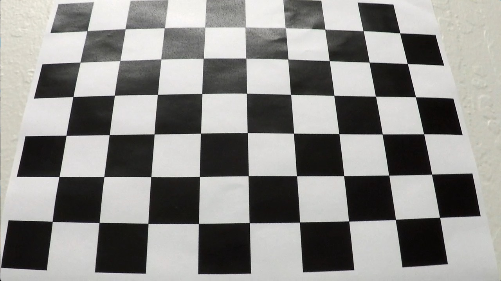

# Advanced Lane Finding Project

The goals / steps of this project are the following:

* Compute the camera calibration matrix and distortion coefficients given a set of chessboard images.
* Apply a distortion correction to raw images.
* Use color transforms, gradients, etc., to create a thresholded binary image.
* Apply a perspective transform to rectify binary image ("birds-eye view").
* Detect lane pixels and fit to find the lane boundary.
* Determine the curvature of the lane and vehicle position with respect to center.
* Warp the detected lane boundaries back onto the original image.
* Output visual display of the lane boundaries and numerical estimation of lane curvature and vehicle position.

[//]: # (Image References)

[image1]: ./examples/undistort_output.png "Undistorted"
[image2]: ./test_images/test1.jpg "Road Transformed"
[image3]: ./examples/binary_combo_example.jpg "Binary Example"
[image4]: ./examples/warped_straight_lines.jpg "Warp Example"
[image5]: ./examples/color_fit_lines.jpg "Fit Visual"
[image6]: ./examples/example_output.jpg "Output"
[video1]: ./project_video.mp4 "Video"

## Rubric Points

#### Here I will consider the [rubric points](https://review.udacity.com/#!/rubrics/571/view) individually and describe how I addressed each point in my implementation.  

---

## Writeup

### Camera Calibration

#### 1. Briefly state how you computed the camera matrix and distortion coefficients. Provide an example of a distortion corrected calibration image.

The code for this step is contained in the second code cell of the IPython notebook named `P4.ipynb`.  

I start by preparing "object points", which will be the (x, y, z) coordinates of the chessboard corners in the world. Here I am assuming the chessboard is fixed on the (x, y) plane at z=0, such that the object points are the same for each calibration image.  Thus, `objp` is just a replicated array of coordinates, and `objpoints` will be appended with a copy of it every time I successfully detect all chessboard corners in a test image.  `imgpoints` will be appended with the (x, y) pixel position of each of the corners in the image plane with each successful chessboard detection.  

I then used the output `objpoints` and `imgpoints` to compute the camera calibration and distortion coefficients using the `cv2.calibrateCamera()` function.  I applied this distortion correction to the test image using the `cv2.undistort()` function and obtained this result: 

      

### Pipeline (single images)

#### 1. Provide an example of a distortion-corrected image.

The following right image shows an example of the result after applying distortion correction on the left image:

      

There are two main steps to this process: 

* Use chessboard images to obtain image points and object points, 
* And then use the OpenCV functions `cv2.calibrateCamera()` and `cv2.undistort()` to compute the calibration and undistortion.

#### 2. Describe how (and identify where in your code) you used color transforms, gradients or other methods to create a thresholded binary image.  Provide an example of a binary image result.

I used a combination of color and gradient thresholds to generate a binary image (thresholding steps are contained from #6 to #9 code cells of the IPython notebook named `P4.ipynb`.).  

* First, I defined a function named `abs_sobel_thresh` that applies Sobel x or y, then takes an absolute value and applies a threshold.(#6 code cell in `P4.ipynb`) Here's an example of my output for this step.  

      

* Second, I defined a function named `mag_thresh` to return the magnitude of the gradient for a given sobel kernel size and threshold values.(#7 code cell in `P4.ipynb`) Here's an example of my output for this step.  


* Third, I defined a function named `dir_threshold` to threshold an image for a given range and Sobel kernel.(#8 code cell in `P4.ipynb`) Here's an example of my output for this step.  


* Then, I defined a function named `hls_select` that thresholds the combination of the S-channel and L-channel in HLS.(#9 code cell in `P4.ipynb`) Here's an example of my output for this step. 

 

* Finally, I combined all above thresholds effect together:

```python
combined = np.zeros_like(dir_binary)
combined[((grady == 1) & (hls_binary == 1)) | ((mag_binary == 1) & (dir_binary == 1))] = 1 
```

 

#### 3. Describe how (and identify where in your code) you performed a perspective transform and provide an example of a transformed image.

The code for my perspective transform includes a function called `perspective_transform`, which appears in #10 code cell in `P4.ipynb`.  The `perspective_transform` function takes as inputs an image (`img`), as well as the perspective transform matrix (`M`), which can be computed by calling `cv2.getPerspectiveTransform()` function with source (`src`) and destination (`dst`) points.  I chose the hardcode the source and destination points in the following manner:

```python
apex, apey = 360, 258
offset_far = 48
offset_near = 2
src = np.float32([[int(apex-offset_far),apey],
                  [int(apex+offset_far),apey],
                  [int(0+offset_near),390],
                  [int(720-offset_near),390]])
dst = np.float32([[0,0],[720,0],[0,405],[720,405]])
```

This resulted in the following source and destination points:

| Source        | Destination  | 
|:-------------:|:------------:| 
| 312, 258      |   0,   0     | 
| 408, 258      | 720,   0     |
|   2, 390      |   0, 405     | 
| 718, 390      | 720, 405     |

I verified that my perspective transform was working as expected by drawing the `src` and `dst` points onto a test image and its warped counterpart to verify that the lines appear parallel in the warped image.

     

#### 4. Describe how (and identify where in your code) you identified lane-line pixels and fit their positions with a polynomial.

I defined a function called `histogram_pixel_peaks` to locate the lane lines and fit a polynomial by histogram and sliding window.(#14 code cell in `P4.ipynb`)

In this function:

* First, I took a histogram of the bottom half of the image.
* Secondly, I found the peak of the left and right halves of the histogram, which will be the starting point for the left and right lines.
* Third, I created and initialized some variables and arrays for furture calculation, like the number of sliding windows, the height of windows, the width of the windows +/- margin, and so on.
* Then, I stepped through the windows one by one:
    * Identify window boundaries in x and y (and right and left)
    * Draw the windows on the visualization image
    * Identify the nonzero pixels in x and y within the window
    * Append these indices to the lists
    * If pixels found > minpix pixels, recenter next window on their mean position
* Finally, I concatenate the arrays of indices, extract left and right line pixel positions and fit a second order polynomial to left and right lanes.

 

#### 5. Describe how (and identify where in your code) you calculated the radius of curvature of the lane and the position of the vehicle with respect to center.

* First, I defined conversions in x and y from pixels space to meters.(#17 code cell in `P4.ipynb`)
```python
ym_per_pix = 25/720 # meters per pixel in y dimension
xm_per_pix = 3.7/675 # meteres per pixel in x dimension
```
* Second, I defined y-value where we want radius of curvature. I chose 3 y-values(max, mean and min).
```python  
y_eval1 = np.max(yvals)
y_eval2 = np.mean(yvals)
y_eval3 = np.min(yvals)
left_fitx_1 = left_fit[0]*y_eval1**2 + left_fit[1]*yvals + left_fit[2]
left_fitx_2 = left_fit[0]*y_eval2**2 + left_fit[1]*yvals + left_fit[2]
left_fitx_3 = left_fit[0]*y_eval3**2 + left_fit[1]*yvals + left_fit[2]
right_fitx_1 = right_fit[0]*y_eval1**2 + right_fit[1]*yvals + right_fit[2]
right_fitx_2 = right_fit[0]*y_eval2**2 + right_fit[1]*yvals + right_fit[2]
right_fitx_3 = right_fit[0]*y_eval3**2 + right_fit[1]*yvals + right_fit[2]
```    
* Third, I defined a function named `find_3p_circle_radius` to finding the radius of the circle through 3 Points and used it to calculate steering angle and turning radius:

 

```python
m1 = (y2-y1)/(x2-x1)
m2 = (y3-y2)/(x3-x2)
    
xc = (m1*m2*(y1-y3)+m2*(x1+x2)-m1*(x2+x3))/(2*(m2-m1))
yc = -(xc-(x1+x2)/2)/m1+(y1+y2)/2
    
Radius = np.sqrt((x2-xc)*(x2-xc)+(y2-yc)*(y2-yc))
       
lm1, lm2, lxc, lyc, lradius = find_3p_circle_radius(left_fitx_1,y_eval1,left_fitx_2,y_eval2,left_fitx_3,y_eval3,)
l_steering_angle = 5*360/lxc # assume xc <> 0, xc and radius value is very close, xc will show the direction as well
    
    
rm1, rm2, rxc, ryc, rradius = find_3p_circle_radius(right_fitx_1,y_eval1,right_fitx_2,y_eval2,right_fitx_3,y_eval3,)
r_steering_angle = 5*360/rxc # assume xc <> 0, xc and radius value is very close, xc will show the direction as well
    
steering_angle = l_steering_angle + r_steering_angle
turning_radius = (lradius+rradius)/2 # smooth out the radius
```  
The details behind this function can be found at http://www.intmath.com/applications-differentiation/8-radius-curvature.php.

* Finally, I found camera position
Origianally, I was using the following code to calculate the camera_pos.
```python
left_mean = np.mean(leftx)
right_mean = np.mean(rightx)
camera_pos = (combined.shape[1]/2)-np.mean([left_mean, right_mean])
```  
 However the position estimate somehow depends on the road curving left or right. This is because the lane line base estimates are based on np.mean(leftx) and np.mean(rightx) which is a noise source and it has a bias towards the direction of the curve. I was suggested to use the already fitted polynomials which gives a less noisy, unbiased estimates for lane bases. So I changed the code to:
 ```python
leftx_int = left_fit[0]*720**2 + left_fit[1]*720 + left_fit[2]
rightx_int = right_fit[0]*720**2 + right_fit[1]*720 + right_fit[2]
camera_pos = abs(640 - ((rightx_int+leftx_int)/2))
 ```

#### 6. Provide an example image of your result plotted back down onto the road such that the lane area is identified clearly.

* First, I created a blank image warp_zero, same size as the one applied to the pipeline and used `cv2.fillPoly()` to draw the closed area and curverad information and Camera Position. (#17 code cell in `P4.ipynb`)

* Then, I used inverted perspective transform matrix `Mi` and `cv2.warpPerspective()` to warp the filled polylines back to original view and combined the result with the original image.

There are 8 test images, my pipeline performs well on 6 of them, as shown below:

 

However when the pavement color is changing or on the shadowy part of the road in 2 of the images, my pipeline has little issue to accurately identify the lane lines (see the images below):


---

### Pipeline (video)

#### 1. Provide a link to your final video output.  Your pipeline should perform reasonably well on the entire project video (wobbly lines are ok but no catastrophic failures that would cause the car to drive off the road!).

Here's a [link to my video result](https://github.com/yuxihe/SelfDrivingCarProj/blob/master/P4-CarND-AdvancedLaneLines/project_video_output.mp4)

I did the following steps to improve my pipeline to have a better performance on the testing video:

* First,  I defined a Line() class to keep track of all the interesting parameters measured from frame to frame, which will make it easier when previous film frames already have successfully identified lane boundaries.(#19 code cell in `P4.ipynb`)
    * Inside the class I defined several functions which will be used to detect the pixels belonging to each lane line.
        * `__init__(self)`: stores all useful parameters from frame to frame.
        * `found_search`: this function will be called when the lane lines have been detected in the previous frame. It uses a sliding window to search for lane pixels in close proximity (+/- 25 pixels in the x direction) around the previous detected polynomial. 
        * `blind_search`: this function will be applied in the first few frames and/or if the lane was not successfully detected in the previous frame. It uses a slinding window approach to detect peaks in a histogram of the binary thresholded image. Pixels in close proimity to the detected peaks are considered to belong to the lane lines.
        * `radius_of_curvature`: measures Radius of Curvature for each lane line in meters.
        * `get_intercepts`: calculates intercepts to extend the polynomial to the top and bottom of warped image
* Second, I fine tuned my thresholding methods and even implemented new methods. (#20 code cell in `P4.ipynb`)

    Previously I was using S Channel from the HLS color space and combined with L Channel from the LUV color space. Now I used combined L channel, R Channel from RGB space, and the B channel from the Lab color space. The reason for this is because:
    * The R Channel from RGB space, with a min threshold of 225 and a max threshold of 255, did a very good job on identifying both yellow and white lines. It did not as good as b channel in terms of the ability on yellow lines.
    * The L Channel from the LUV color space, with a min threshold of 225 and a max threshold of 255, did an almost perfect job of picking up the white lane lines, but completely ignored the yellow lines.
    * The B channel from the Lab color space, with a min threshold of 155 and an upper threshold of 200, did a better job than the S channel in identifying the yellow lines, but completely ignored the white lines.
    * Combining the above 3 channels does a great job of highlighting almost all of the white and yellow lane lines. The reason I did not select S because the other 3 has completely cover what S channel provides plus S channel contains more noise than other ones.

* Finally, I implemented the new pipeline for video processing:
    * step 1. Camera calibration and distort correction
    * step 2. Perform perspective transform
    * step 3. Generate binary thresholded images
    * step 4. Perform blind search or search around previous polynomial for lane line and calculate polynomial fit.
    * step 5. Calculate intercepts, append them to stored arrays, then average them across n frames and recalculate polynomial.
    * step 6. Compute radius of curvature for each lane in meters.
    * step 7. Calculate the vehicle position relative to the center of the lane.
---

### Discussion

#### 1. Briefly discuss any problems / issues you faced in your implementation of this project.  Where will your pipeline likely fail?  What could you do to make it more robust?

* Combining all the new tools I learned from class and making improvment based on what I want to achieve. I think thie part is tricky because we are given so many useful tools and techniques in the class, besides getting farmilar with them, we also need to choose which one we want to apply in our project and which one we need to have further improvement in order to get the result we want.

* Tuning the threshholds for each transform is very time consuming and sometimes can feel a little bit lost. One setting may work for one picture but not work for other pictures. 

* The pipeline perfoms good on the project video. But it has some difficulty to handle challenge video. And completely fail on the harder challenge.

To make if more robust:
* Keep tracking the defined lanes. The curve would not change suddenly, event lose a few frames of image stream. 
* Maybe can fit lane with more complex model, rather than polunomial function.
