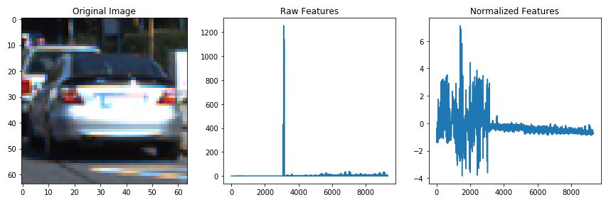
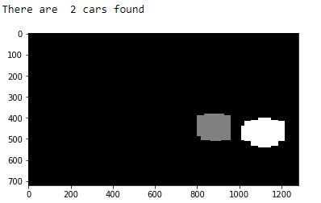

# Vehicle Detection Project

The goals / steps of this project are the following:

* Perform a Histogram of Oriented Gradients (HOG) feature extraction on a labeled training set of images and train a classifier Linear SVM classifier
* Optionally, you can also apply a color transform and append binned color features, as well as histograms of color, to your HOG feature vector. 
* Note: for those first two steps don't forget to normalize your features and randomize a selection for training and testing.
* Implement a sliding-window technique and use your trained classifier to search for vehicles in images.
* Run your pipeline on a video stream (start with the test_video.mp4 and later implement on full project_video.mp4) and create a heat map of recurring detections frame by frame to reject outliers and follow detected vehicles.
* Estimate a bounding box for vehicles detected.

### Rubric Points
#### Here I will consider the [rubric points](https://review.udacity.com/#!/rubrics/513/view) individually and describe how I addressed each point in my implementation.  

---
## Basic steps of this project:

### Import packages and define useful functions

In the first 2 code cells of the IPython notebook, I import packages and define the following useful functions:
1. Define a function to return HOG features and visualization : get_hog_features()
2. Define a function to compute binned color features: bin_spatial()
3. Define a function to compute color histogram features : color_hist()
4. Define a function to extract features from a list of images: extract_features()
5. Define a function to return slide search windows : slide_window()
6. Define a function to draw bounding boxes : draw_boxes()
7. Define a function to extract features from a single image window : single_img_features()
8. Define a function to search the windows for specified features : search_windows()

### Read In vehicle and non-vehicle dataset

Here are links to the labeled data for [vehicle](https://s3.amazonaws.com/udacity-sdc/Vehicle_Tracking/vehicles.zip) and [non-vehicle](https://s3.amazonaws.com/udacity-sdc/Vehicle_Tracking/non-vehicles.zip) examples used to train the classifier.  These example images come from a combination of the [GTI vehicle image database](http://www.gti.ssr.upm.es/data/Vehicle_database.html), the [KITTI vision benchmark suite](http://www.cvlibs.net/datasets/kitti/), and examples extracted from the project video itself.

I started by reading in all the `vehicle` and `non-vehicle` images. There are 8792 images for vehicles and 8968 images for non-vehicles. Here is an example of one of each of the `vehicle` and `non-vehicle` classes:

### Histogram of Oriented Gradients (HOG)

#### 1. Explain how (and identify where in your code) you extracted HOG features from the training images.

The code for this step is contained in the 2rd, 5th and 6th code cells of the IPython notebook.  

I used HoG (Histogram of oriented gradients), spatial_features, color histogram to extract image features. 
1. spatial feature (reduce the image size): `spatial_features = bin_spatial(feature_image, size=spatial_size)`
2. color histogram feature (np.histogram on color image):`hist_features = color_hist(feature_image, nbins=hist_bins)`
   - I grabbed random images from each of the two classes and displayed them to get a feel for what the `color_hist()` output looks like. And here is an example:

    

3. HoG feature (get histogram of oriented gradient after converting image to certain color space onto every block and cells, hog is in `skimage.feature` package):
`features, hog_image = hog(img, orientations=orient, pixels_per_cell=(pix_per_cell, pix_per_cell), cells_per_block=(cell_per_block, cell_per_block), transform_sqrt=True, visualise=vis, feature_vector=feature_vec)`
   - I grabbed random images from each of the two classes and displayed them to get a feel for what the `skimage.hog()` output looks like. And here is an example using the `YCrCb` color space and HOG parameters of `orientations=8` and `pixels_per_cell=(7, 7)`:

    

#### 2. Explain how you settled on your final choice of HOG parameters.

The code for this step is contained in the 8th, 9th and 10th code cells of the IPython notebook.  

Then, I normalize features and use machine learning method (SVM in this task) to train dataset using optimized parameters for extracting features.

I used StandScaler() to normalize extracted features. And we could see before and after normalization:

 

In this project linear SVM is used and provided an acceptable testing accuracy. 

I tried different combination of HoG settings as well color space for feature extraction. The different option testing accuracies are included below: 

| Op | Color Space | Spatial_size |Hist_bins|  Orientations | Pixels_per_cell | Cells_per_block | HOG channel | Test Accuracy |
|:--:|:-----------:|:------------:|:-------:|:-------------:|:---------------:|----------------:|------------:|--------------:|
| 0   |  RGB   | (16,16) | 32 | 8 | 7 | 2 | All | 97.2% |
| 1   |  HSV   | (16,16) | 32 | 8 | 7 | 2 | All | 98.2% |
| 2   |  HLS   | (16,16) | 32 | 9 | 8 | 2 | All | 98.1% |
| 3   |  YCrCb | (32,32) | 32 | 9 | 7 | 2 | All | 98.5% |
| 4   |  YCrCb | (32,32) | 16 | 8 | 7 | 2 | All | 98.8% |
| 5   |  YCrCb | (32,32) | 32 | 8 | 7 | 2 | All | 98.9% |
| 6   |  YCrCb | (16,16) | 32 | 8 | 8 | 2 | All | 98.7% |
| 7   |  YCrCb | (16,16) | 32 | 8 | 7 | 2 | All | 98.3% |

Hence I chose option 5 which use ColorSpace of YCrCb and Spatial_size (32,32), 32 Hist bins, orient 8, Pixels_per_cell 7, Cell_per_block of 2, HOG channel All. 
#### 3. Describe how (and identify where in your code) you trained a classifier using your selected HOG features (and color features if you used them).

The code for this step is contained in the 10th code cells of the IPython notebook.  

I trained a linear SVM using 80% of dataset as training set and 20% as testing set. I shuffled data before training to avoid algortihm remembering the ordering. 

### Sliding Window Search

#### 1. Describe how (and identify where in your code) you implemented a sliding window search.  How did you decide what scales to search and how much to overlap windows?

The code for this step is contained in the 12th code cells of the IPython notebook. 

I tried different scales for sliding window search. And here is an example using the search window size = `xy_window=(96, 96)`,  and overlap = `xy_overlap=(0.5, 0.5)`:

#### 2. Show some examples of test images to demonstrate how your pipeline is working.  What did you do to optimize the performance of your classifier?

The code for this step is contained in the 13th and 14th code cells of the IPython notebook. 

Ultimately,
- I searched on six scales using YCrCb 3-channel HOG features plus spatially binned color and histograms of color in the feature vector:
- The six search windows are: `XY_window = [(240, 240), (200, 200), (160, 160), (120, 120), (80, 80), (60, 60)]`
- X direction cover from leftmost to rightmost, while y direction covers from 380 to 500. 
- I used overlay of 75% as a default. 
- I chose to search smaller windows mainly at the horizon for smaller car images as they will appear far away. which provided a nice result. 

Here are some example images:

### Video Implementation

#### 1. Provide a link to your final video output.  Your pipeline should perform reasonably well on the entire project video (somewhat wobbly or unstable bounding boxes are ok as long as you are identifying the vehicles most of the time with minimal false positives.)

Here's a [link to the test video result](https://github.com/yuxihe/SelfDrivingCarProj/blob/master/P5-CarND-VehicleDetection/test_video_out.mp4)
Here's a [link to the project video result](https://github.com/yuxihe/SelfDrivingCarProj/blob/master/P5-CarND-VehicleDetection/project_video_out.mp4)

#### 2. Describe how (and identify where in your code) you implemented some kind of filter for false positives and some method for combining overlapping bounding boxes.

The code for this step is contained in the 15th, 16th, 17th and 18th code cells of the IPython notebook.

As expected there are some false positive windows and multiple detections. 
- I use heatmap for the recurring detection and apply threshold to filter out low recurrence which are more likely false positive. 
- I then used `scipy.ndimage.measurements.label()` to identify individual blobs in the heatmap.

Here are 3 test images and their corresponding heatmaps:

I then assumed each blob corresponded to a vehicle.  I constructed bounding boxes to cover the area of each blob detected.  Here is the output of `scipy.ndimage.measurements.label()` on the integrated heatmap from the test image:

Here's an example result showing the heatmap from a test image, the result of `scipy.ndimage.measurements.label()` and the bounding boxes then overlaid:

### The files for submission: 
* P5.ipynb (IPython notebook)
* folder `output_images` (output images)
* test_video_out.mp4, project_video_out.mp4 (output video mp4 files)
* README.md (The writeup includes a statement and supporting images that explain how each rubric item was addressed, and specifically where in the code each step was handled.)

### Discussion

#### 1. Briefly discuss any problems / issues you faced in your implementation of this project.  Where will your pipeline likely fail?  What could you do to make it more robust?

In this project, I chose to use sliding window search, which has to extract hog features for every search window hence it runs slow. Instead, I can improve my pipeling by using Hog Sub-sampling Window Search, which only has to extract hog features once, for each of a small set of predetermined window sizes (defined by a scale argument), and then can be sub-sampled to get all of its overlaying windows.

Choosing resonable parameters for HOG features is also tricky and time consuming. I'm not sure if the Parameter Tuning in Scikit-learn can be applied also to do an automatic parameter search for HOG features. Due to the tight schedule, I didn't spend time on that and chose to tune the parameters manually.

As we could see from the output video, the vehicle detection is still not perfect yet as it sometimes gives pretty large bounding box onto the car which in practice means low accuracy of knowing where exactly the car is. Also there are still some false positive in some cases especially some road rails. An improvement could be using smaller sliding windows or apply reasonalbe threshold on heatmap. 

Another further possible improvement is to achieve better testing accuracy using deep learning method instead of linear SVM.

